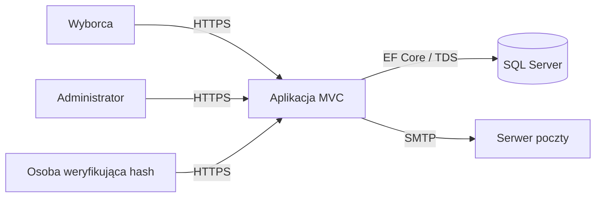
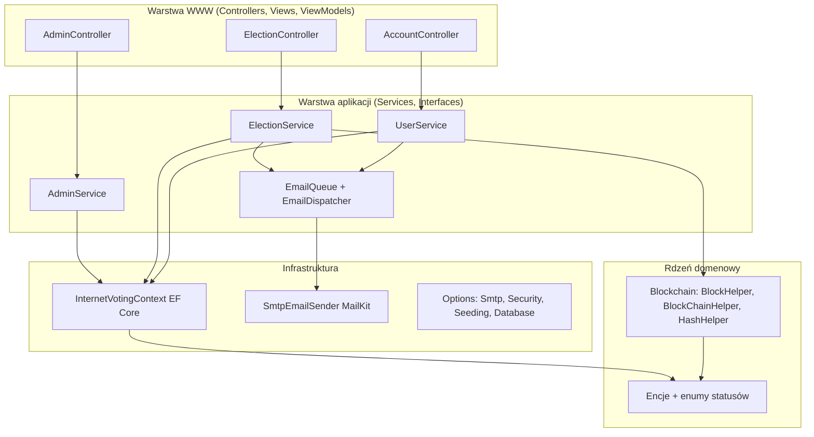
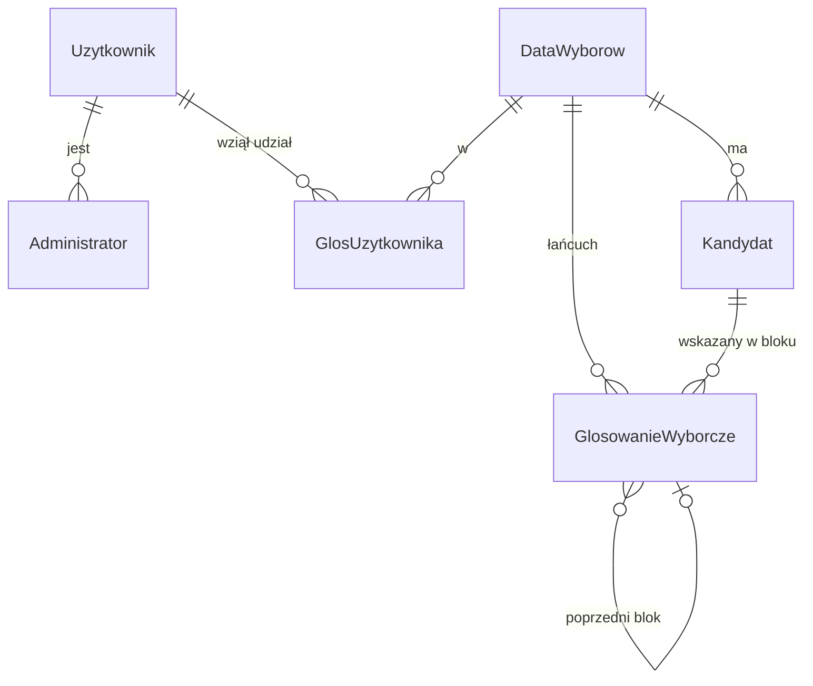
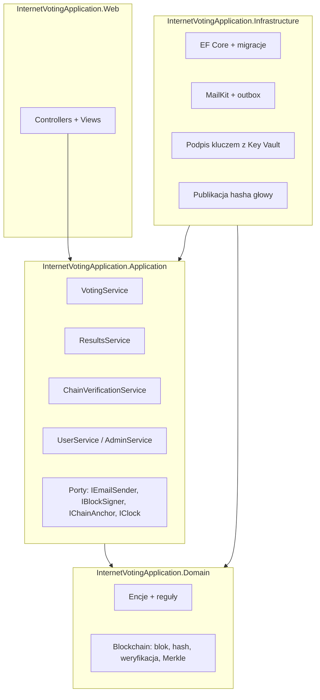

# Analiza architektury systemu

Stan po zmianach z gałęzi `claude/cool-faraday-rbysn2` (2026-09-25). Ocena odpowiada na pytanie:
czy architektura jest poprawna (spójna, bez błędów konstrukcyjnych) i odpowiednia (dopasowana do celu
pracy inżynierskiej i do problemu, jakim jest głosowanie internetowe z weryfikowalnym rejestrem głosów).

---

## 1. Architektura obecna

### 1.1 Widok kontekstu

Jeden proces aplikacji, jedna baza danych, jedna zewnętrzna zależność (SMTP). Klasyczny monolit.

### 1.2 Widok komponentów

Kierunek zależności (wynik z analizy `using` w kodzie):

| Komponent | Zależy od |
| --- | --- |
| Controllers | Interfaces, ViewModels, Models (enumy), ExtensionMethods |
| Services | Interfaces, Models (encje + DbContext), ViewModels, Blockchain, Configuration |
| Blockchain | Models (encja `GlosowanieWyborcze`) |
| Services/Mail | Interfaces, Configuration |
| Data | Configuration, Models |

Rozmiar: ok. 2,6 tys. linii kodu produkcyjnego (w tym ~1 tys. widoków) i 1,1 tys. linii testów.

### 1.3 Model danych

Kluczowa decyzja: `GlosowanieWyborcze` (blok = głos) nie ma klucza obcego do `Uzytkownik`.
Udział w głosowaniu (`GlosUzytkownika`) i treść głosu są w osobnych tabelach.

---

## 2. Ocena: co jest poprawne

1. **Wzorzec warstwowy jest zastosowany konsekwentnie.** Kontrolery nie dotykają `DbContext`; cała logika
   jest w serwisach za interfejsami. Kontrolery tłumaczą wyniki serwisów (enumy statusów) na HTTP
   i komunikaty. To właściwy podział odpowiedzialności dla MVC.
2. **Rdzeń łańcucha jest czysty.** `Blockchain/` to funkcje bez stanu i bez zależności od EF, ASP.NET
   czy poczty. Można je testować jednostkowo i pokazać w pracy jako samodzielny algorytm (tak są testowane).
3. **Efekty uboczne są odseparowane.** Wysyłka poczty przechodzi przez `IEmailSender` i kolejkę; czas
   przez `TimeProvider`. Dzięki temu serwisy są deterministyczne w testach i awaria SMTP nie psuje żądania.
4. **Granice transakcyjne są we właściwym miejscu.** Oddanie głosu jest jedną operacją serwisu
   w transakcji `Serializable`, a reguły (okno czasowe, przynależność kandydata, jeden głos) są
   egzekwowane w serwisie i dodatkowo przez unikalne indeksy w bazie. Baza jest ostatnią linią obrony,
   nie jedyną.
5. **Konfiguracja przez `IOptions`** z walidacją, sekrety poza repozytorium, seeding administratorów
   przez konfigurację. Standard w ASP.NET Core.
6. **Uwierzytelnianie oparte na mechanizmie frameworka** (cookie auth, role, polityki), a nie na własnych
   flagach w sesji.
7. **Testowalność**: trzy poziomy testów (jednostkowe, serwisowe na SQLite, integracyjne przez
   `WebApplicationFactory`) bez zewnętrznych zależności. To jest właściwa piramida dla tej skali.
8. **Brak nadmiarowych abstrakcji.** Nie ma warstwy repozytoriów nad EF Core ani generycznego "unit of work";
   `DbContext` już nimi jest. Dla projektu tej wielkości dodatkowe warstwy tylko utrudniłyby czytanie.

Wniosek: jako **aplikacja webowa** architektura jest poprawna i adekwatna do rozmiaru. Warstwowy monolit
z EF Core i serwisami to właściwy wybór dla pracy inżynierskiej; Clean Architecture w kilku projektach lub
mikroserwisy byłyby przerostem formy nad treścią.

---

## 3. Ocena: gdzie architektura jest słaba lub nieodpowiednia do problemu

Poniższe punkty są ważniejsze od jakości kodu, bo dotyczą tego, czy system realizuje obietnicę
"weryfikowalnego głosowania". Warto je omówić w pracy jako świadome ograniczenia albo rozwiązać.

### 3.1 Jedna domena zaufania (najpoważniejsze)

Aplikacja, baza użytkowników, rejestr głosów i mechanizm weryfikacji działają w **jednym procesie
i jednej bazie z jednym kontem dostępowym**. Każdy, kto ma uprawnienia do bazy (administrator SQL,
administrator aplikacji, atakujący po przejęciu serwera), może:

- zmienić głosy i przeliczyć hashe całego łańcucha (weryfikacja przejdzie),
- dopisać głosy bez wpisów w `GlosUzytkownika`,
- odczytać, kto na kogo głosował (patrz 3.2).

Weryfikacja łańcucha chroni więc wyłącznie przed **przypadkowym uszkodzeniem danych i naiwną
modyfikacją pojedynczego wiersza**, a nie przed osobą kontrolującą system. To jest fundamentalna różnica
względem blockchaina rozproszonego i należy ją nazwać wprost.

Kierunki architektoniczne (od najprostszego):

1. **Podpis bloków kluczem poza bazą** (HMAC lub ECDSA, klucz w Key Vault / zmiennej środowiskowej
   dostępnej tylko procesowi aplikacji). Atakujący z dostępem tylko do bazy nie przeliczy łańcucha.
   Nie chroni przed administratorem aplikacji.
2. **Publikacja hasha głowy** (`HeadHash`, liczba bloków, znacznik czasu) po każdym N głosach lub co
   interwał do miejsca, którego administrator aplikacji nie kontroluje: e-mail do komisji, wpis w
   zewnętrznym repozytorium, publiczny endpoint archiwizowany przez obserwatorów. Umożliwia wykrycie
   przepisania historii.
3. **Rozdzielenie na dwa komponenty**: usługa uprawnień (kto może głosować, uwierzytelnianie) i usługa
   urny (przyjmuje anonimowe, podpisane głosy i prowadzi łańcuch), z osobnymi bazami i osobnymi kontami.
   To dopiero daje sens określeniu "rozproszony rejestr".
4. **Wiele węzłów weryfikujących** (symulacja): każdy blok trafia do 2-3 procesów, które niezależnie
   weryfikują i potwierdzają. Materiał na rozdział o konsensusie, ale duży koszt implementacji.

### 3.2 Tajność głosu nie jest zapewniona architektonicznie

Blok głosu i wpis o udziale są zapisywane w **jednej transakcji, w tej samej kolejności**. Korelacja
`GlosowanieWyborcze.id` z `GlosUzytkownika.id` (albo znaczników czasu) odtwarza powiązanie wyborca → głos
dla każdego, kto czyta bazę. Brak klucza obcego to kosmetyka, nie gwarancja.

Rozwiązanie architektoniczne: **rozdzielenie uprawnienia od oddania głosu w czasie i tożsamości**.
Wyborca po zalogowaniu pobiera jednorazowy, losowy token urny (zapisany jako hash, bez powiązania
z kolejnością), a głos oddaje w osobnym żądaniu, które nie przenosi tożsamości, tylko token.
Dodatkowo zapis bloku może być buforowany i wykonywany w losowej kolejności w partiach. To zmienia
model danych (nowa tabela tokenów) i przepływ w `ElectionService`, ale nie strukturę warstw.

### 3.3 Weryfikacja łańcucha nie skaluje się

Każde oddanie głosu i każde wejście na wyniki ładuje **cały łańcuch wyborów do pamięci** i weryfikuje
go od zera. Dla jednego głosowania z 10 tys. głosów to 10 tys. odczytów i SHA-256 przy każdym głosie,
czyli O(n²) pracy w skali całych wyborów, w krytycznej sekcji transakcji `Serializable` (blokuje inne
głosy w tych samych wyborach).

Rozwiązanie: **przechowywać stan głowy** (`HeadHash`, `BlockCount`) w `DataWyborow` z blokadą
optymistyczną (`rowversion`) i weryfikować przy głosie tylko: ostatni blok względem głowy oraz nowy blok.
Pełną weryfikację uruchamiać w tle (`BackgroundService`, co kilka minut) i na żądanie administratora,
zapisując wynik. Strony wyników i wyszukiwarki czytają zapisany wynik zamiast liczyć.

### 3.4 Kolejka poczty jest w pamięci procesu

`Channel<T>` znika przy restarcie; e-mail z hashem głosu może nie dojść, choć głos jest zapisany.
Dla pracy inżynierskiej akceptowalne (hash widać na stronie potwierdzenia), ale poprawny wzorzec to
**outbox**: tabela wiadomości do wysłania zapisywana w tej samej transakcji co głos, opróżniana przez
dispatcher. Zmiana lokalna, bez wpływu na warstwy.

### 3.5 Model domenowy jest "anemiczny"

Encje to kontenery danych, wszystkie reguły są w serwisach (`ElectionService` ma ~300 linii i robi
listowanie, głosowanie, wyniki, wyszukiwanie i weryfikację). Dla tej skali to działa, ale warto
wyodrębnić:

- `ElectionService` → `VotingService` (oddanie głosu), `ResultsService` (wyniki, wyszukiwanie) i
  `ChainVerificationService` (weryfikacja, stan głowy). Każdy z jedną odpowiedzialnością.
- reguły statusu wyborów są już na encji (`DataWyborow.GetStatus`), to dobry kierunek: reguła
  "czy kandydat należy do wyborów" i "czy wyborca może głosować" mogą też być metodami domenowymi.

### 3.6 Niespójności strukturalne (dziedzictwo pierwotnej wersji)

- Modele formularzy `Logowanie`, `ChangePassword`, `PasswordRecovery` leżą w `Models/` obok encji,
  a reszta w `ViewModels/`. Powinny być razem w `ViewModels/`.
- Folder `ExtensionMethods/` zawiera walidatory, atrybuty i szablony e-mail, które nie są extension
  methods. Naturalny podział: `Validation/` (PESEL, wiek, e-mail), `Services/Mail/EmailTemplates`.
- `DbContext` leży w `Models/` zamiast w `Data/` (zostawiony ze względu na stare migracje).
- Nazwy encji po polsku (`DataWyborow` znaczy "data wyborów", a jest to encja "Wybory"), reszta kodu
  po angielsku. Do decyzji autora; ważna jest konsekwencja i słowniczek w pracy.
- Tabela `Administrator` jako osobna encja zamiast kolumny roli: poprawne (pozwala na więcej ról
  i audyt), ale przy jednej roli to nadmiar. Do utrzymania, jeśli planowane są kolejne role
  (np. komisja, obserwator).
- Czas: aplikacja używa czasu lokalnego serwera (`GetLocalNow`) zarówno dla dat wyborów, jak i znaczników
  bloków. Spójne, ale przy przeniesieniu serwera do innej strefy zmieni interpretację dat. Bezpieczniej:
  UTC w bazie, konwersja w widoku.

### 3.7 Warstwa operacyjna

- Brak `health checks` (`/health`) i metryk; kompozycja Docker nie ma reverse proxy z TLS.
- Logowanie tylko do konsoli; brak korelacji żądań w logach (Serilog + `RequestId`).
- Migracje przy starcie (`ApplyMigrationsOnStartup`) są wygodne w developmencie, ale w produkcji
  z wieloma instancjami to wyścig; tam migracje powinny być krokiem wdrożenia.

---

## 4. Rekomendowana architektura docelowa (dla pracy)

Bez zmiany technologii i bez rozbijania na mikroserwisy:

Kolejność wdrażania (każdy krok jest samodzielnie testowalny):

1. Stan głowy łańcucha w `DataWyborow` + weryfikacja przyrostowa + weryfikacja pełna w tle (3.3).
2. Podpis bloku kluczem serwera (`IBlockSigner`) i pole `Podpis` w bloku (3.1 pkt 1).
3. Publikacja hasha głowy (`IChainAnchor`): na początek e-mail do skonfigurowanego adresu komisji
   po zakończeniu wyborów i co N bloków (3.1 pkt 2).
4. Tokeny urny rozdzielające tożsamość od głosu (3.2).
5. Outbox dla poczty (3.4).
6. Porządki strukturalne: przeniesienie modeli formularzy, walidatorów, `DbContext` (3.6); opcjonalnie
   podział na 3-4 projekty, jeśli praca ma pokazać architekturę warstwową explicite.

Punkty 1-3 są w zasięgu kilku dni pracy i dają najwięcej treści do części teoretycznej
(integralność, niezaprzeczalność, audytowalność). Punkt 4 jest najtrudniejszy koncepcyjnie
i najbardziej wartościowy naukowo (kompromis między weryfikowalnością a tajnością głosu).

---

## 4a. Stan realizacji planu etapu 2 (2026-09-25)

Wykonane (szczegóły w `docs/PLAN_ETAP_2.md`):

1. Stan głowy w `DataWyborow` + weryfikacja przyrostowa przy głosie + pełna weryfikacja w tle
   (`ChainVerificationWorker`, tabela `WeryfikacjaLancucha`). Krytyczna sekcja czyta dwa wiersze zamiast
   całego łańcucha; konflikt współbieżny rozstrzyga token `Wersja` z ponowieniem.
2. Podpis bloków ECDSA P-256 (`IBlockSigner`, `EcdsaBlockSigner`, `SigningKeyProvider`), klucz poza bazą,
   klucz publiczny na stronie łańcucha i w eksporcie.
3. Kotwice (`KotwicaLancucha`, `IChainService.PublishAnchorAsync`): co N bloków, po zakończeniu wyborów
   i ręcznie; e-mail do komisji przez outbox.
4. Publiczna strona `/Election/Chain/{id}` i eksport `/Election/Export/{id}`; niezależny weryfikator
   `tools/ChainVerifier` wykrywa podmianę głosu, przepisanie historii (przez kotwicę) i skrócenie łańcucha.
5. Outbox poczty (`WiadomoscEmail`, `EmailDispatcher` z ponawianiem i back-offem).
6. `ElectionService` rozbity na `ElectionService`, `ResultsService`, `ChainService`; dziennik audytu;
   panel wyborów administratora; rate limiting; `/health`; Serilog.

Nadal otwarte: tajność głosu (3.2, wymaga mieszania lub ślepych podpisów), przeniesienie modeli formularzy
i walidatorów do właściwych folderów (3.6, wymaga usuwania plików), UTC w bazie, wiele węzłów weryfikujących.

## 5. Podsumowanie

| Aspekt | Ocena | Komentarz |
| --- | --- | --- |
| Podział na warstwy | dobra | konsekwentny MVC + serwisy + czysty rdzeń łańcucha |
| Dobór technologii | dobra | ASP.NET Core 9, EF Core, SQL Server; adekwatne i wspierane |
| Testowalność | dobra | trzy poziomy testów bez zewnętrznych zależności |
| Bezpieczeństwo aplikacyjne | dobra | auth frameworka, CSRF, lockout, sekrety poza kodem |
| Integralność rejestru | dobra (po etapie 2) | podpisy ECDSA, kotwice poza systemem, weryfikacja niezależnym narzędziem; nadal jedna baza |
| Tajność głosu | słaba | korelacja przez kolejność zapisu w jednej transakcji; nierozwiązane |
| Skalowalność | dobra (po etapie 2) | głos czyta głowę i ostatni blok; pełna weryfikacja w tle |
| Odporność operacyjna | dobra (po etapie 2) | outbox z ponawianiem, `/health`, Serilog, rate limiting |
| Spójność struktury | dostateczna | pozostałości pierwotnego układu folderów i nazw |

Architektura jest **poprawna jako aplikacja webowa** i po etapie 2 realizuje **weryfikowalność**:
podpisy kluczem poza bazą, kotwice wysyłane poza system i niezależny weryfikator sprawiają, że przepisanie
historii wymaga jednocześnie dostępu do bazy, do klucza i do skrzynek odbiorców kotwic, a i wtedy pozostaje
wykrywalne przez porównanie z zachowanymi kotwicami. **Tajność głosu** pozostaje ograniczeniem konstrukcyjnym
jednej bazy i jest opisana jako kierunek badawczy (mixnet, ślepe podpisy).
